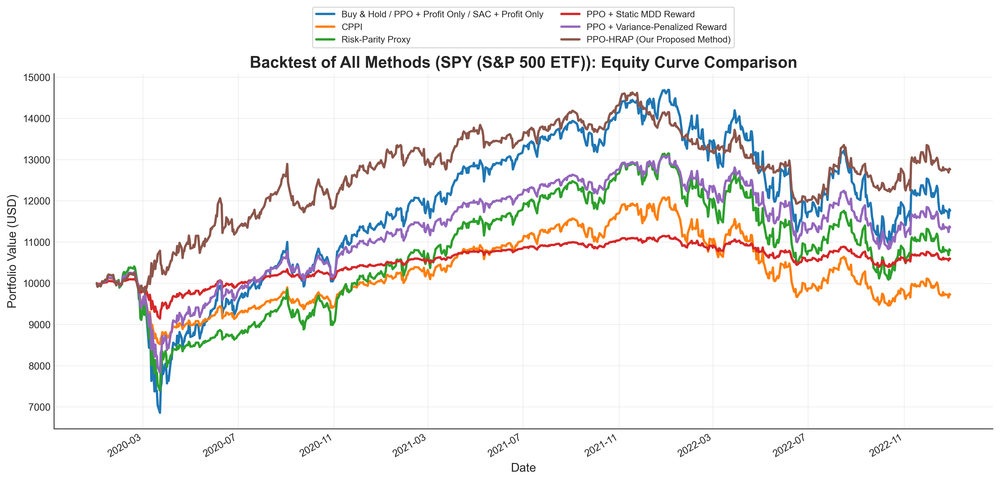
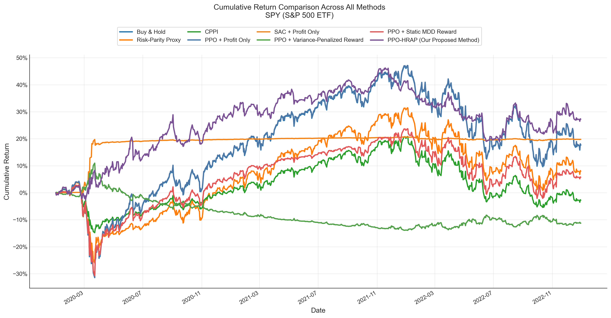
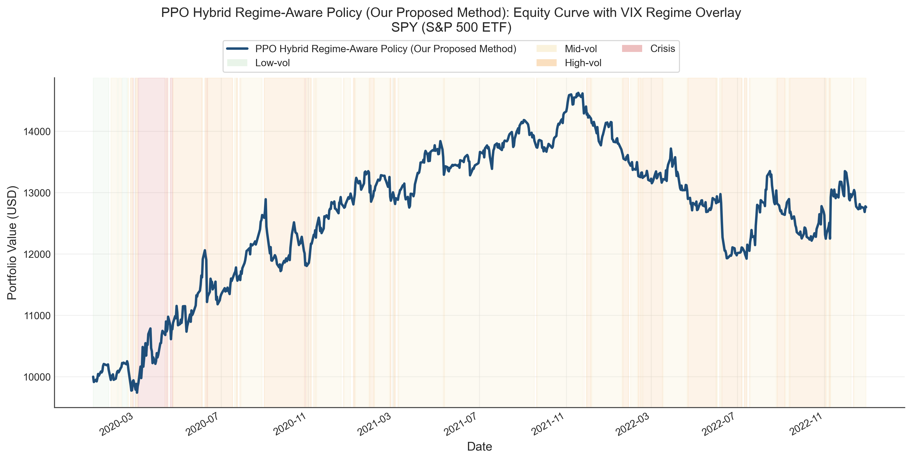
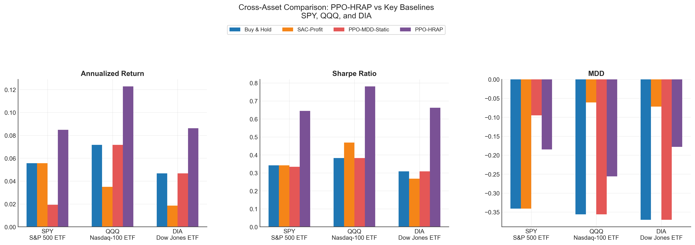

# PPO Hybrid Regime-Aware Policy for RL Trading

This repository contains a research-oriented reinforcement learning framework for single-asset trading under changing volatility regimes. The core contribution is **PPO Hybrid Regime-Aware Policy (PPO-HRAP)**, a hybrid control design that combines drawdown-aware reward shaping, volatility-conditioned risk control, and a regime-guided action prior.

The project is organized to support:

- baseline benchmarking against financial and RL methods,
- reproducible train/validation/test evaluation,
- multi-seed reliability analysis,
- cross-asset experiments on ETF proxies such as `SPY`, `QQQ`, and `DIA`.

## Overview

### Task

- Risky asset: ETF proxy such as `SPY`, `QQQ`, or `DIA`
- Defensive asset: cash
- Regime signal: `^VIX`
- Decision variable: portfolio weight in the risky asset

### Proposed Method

PPO-HRAP is not a reward-only baseline. It is a hybrid policy with three coordinated components:

1. **Drawdown-aware reward shaping**

```text
reward_t
= log_return_t
- lambda_rrc(t) * drawdown_increase_t
- beta_target * (target_weight_t - desired_weight_t)^2
- beta_turnover * turnover_t
```

2. **Dynamic risk conditioning**

```text
lambda_rrc(t) = lambda_base * (1 + alpha * clamp(vix_zscore_t, -3, 3))
```

3. **Regime-aware action guidance**

```text
target_weight_t
= (1 - action_prior_weight) * raw_action_t
+ action_prior_weight * desired_weight_t
```

The action prior is designed to keep the learned policy flexible while biasing it toward safer exposure targets during stressed regimes.

## Implemented Methods

### Financial baselines

- Buy & Hold
- Risk-Parity proxy
- CPPI

### RL baselines

- PPO + profit-only reward
- SAC + profit-only reward
- PPO + variance-penalized reward
- PPO + static Markovian MDD reward

### Proposed method

- PPO-HRAP

## Repository Layout

```text
.
|-- baselines/
|   |-- common/
|   |   |-- analysis_utils.py
|   |   |-- asset_utils.py
|   |   `-- metrics.py
|   |-- experiments/
|   |   |-- run_cross_asset_experiments.py
|   |   `-- run_multiseed_reliability.py
|   |-- financial/
|   |   `-- financial_baselines.py
|   |-- ppo_hybrid_regime_aware_policy/
|   |   |-- pipeline.py
|   |   `-- run_proposed_method.py
|   `-- rl/
|       |-- rl_baseline_common.py
|       |-- run_all_rl_baselines.py
|       |-- evaluate_rl_baselines.py
|       |-- train_ppo_profit_only.py
|       |-- train_sac_profit_only.py
|       |-- train_ppo_variance_penalized.py
|       `-- train_ppo_markovian_mdd_static.py
|-- data/
|   |-- crawl_data.py
|   |-- preprocess_indicator_signals.py
|   |-- raw/
|   `-- processed/
|-- env/
|   `-- trading_env.py
|-- reward/
|   |-- profit_only.py
|   |-- variance_penalized.py
|   |-- differential_sharpe.py
|   |-- markovian_mdd_static.py
|   |-- ppo_hybrid_regime_aware_policy.py
|   `-- rrc.py
|-- results/
|   |-- figures/
|   |-- models/
|   `-- tables/
|-- requirements.txt
`-- README.md
```

## Data Pipeline

### Supported assets

- `SPY`
- `QQQ`
- `DIA`
- `IWM`

Current paper-facing outputs are primarily organized around `SPY`, `QQQ`, and `DIA`. `IWM` is retained only as an archived experiment path.

### Default chronological split

- Train: `2010-01-01` to `2017-12-31`
- Validation: `2018-01-01` to `2019-12-31`
- Test: `2020-01-01` to `2022-12-31`

### Processed features

The processed datasets include the raw market columns plus indicator features such as:

- `log_return`
- `sma_ratio`
- `rsi_14`
- `bollinger_band_width`
- `vix_zscore_252`

Raw split files are generated by [data/crawl_data.py](data/crawl_data.py), and processed split files are generated by [data/preprocess_indicator_signals.py](data/preprocess_indicator_signals.py).

## Installation

```powershell
python -m venv .venv
.\.venv\Scripts\python -m pip install -r requirements.txt
```

Core dependencies include:

- `numpy`
- `pandas`
- `matplotlib`
- `gymnasium`
- `stable-baselines3`
- `yfinance`

## Reproducibility

### 1. Prepare data

Download aligned price and VIX data:

```powershell
.\.venv\Scripts\python data\crawl_data.py --assets SPY QQQ DIA
```

Preprocess indicators:

```powershell
.\.venv\Scripts\python data\preprocess_indicator_signals.py --assets SPY QQQ DIA
```

### 2. Run financial baselines

```powershell
.\.venv\Scripts\python baselines\financial\financial_baselines.py
```

### 3. Run RL baselines

```powershell
.\.venv\Scripts\python baselines\rl\run_all_rl_baselines.py
```

### 4. Run the proposed method

This entrypoint runs the current best single-run SPY configuration:

```powershell
.\.venv\Scripts\python baselines\ppo_hybrid_regime_aware_policy\run_proposed_method.py
```

Current single-run configuration:

- `total_timesteps = 30_000`
- `seed = 42`
- `lambda_base = 0.05`
- `alpha = 0.50`
- `beta_target = 0.02`

### 5. Run multi-seed reliability

The multi-seed runner evaluates all RL baselines plus PPO-HRAP using seeds:

- `7`
- `11`
- `19`
- `23`
- `42`

Run on `SPY`:

```powershell
.\.venv\Scripts\python baselines\experiments\run_multiseed_reliability.py --asset SPY
```

Run on another supported asset:

```powershell
.\.venv\Scripts\python baselines\experiments\run_multiseed_reliability.py --asset QQQ
```

### 6. Run the cross-asset experiment suite

This runner executes:

- financial baselines,
- RL baselines,
- PPO-HRAP pipeline,
- multi-seed reliability,

for each selected asset.

```powershell
.\.venv\Scripts\python baselines\experiments\run_cross_asset_experiments.py --assets QQQ DIA
```

## Results Organization

### Tables

Results tables are organized by asset and purpose:

```text
results/tables/
  spy/
    raw/
    curated/
  qqq/
    raw/
    curated/
  dia/
    raw/
    curated/
  summary/
```

- `raw/` contains pipeline outputs written by the underlying experiment code.
- `curated/` contains paper-facing summary tables such as all-method metrics and cumulative-return comparisons.
- `summary/` contains cross-asset aggregate outputs.

### Figures

Figures are organized by asset:

```text
results/figures/
  spy/
  qqq/
  dia/
  cross_asset_proposed_vs_key_baselines_spy_qqq_dia.png
  cross_asset_sharpe_heatmap_spy_qqq_dia.png
```

Each asset folder contains:

- financial baseline comparison,
- RL baseline comparison,
- all-method backtest comparison,
- cumulative return comparison,
- PPO-HRAP diagnostic figures.

### Models

Model artifacts are organized by asset:

```text
results/models/
  spy/
    single_seed/
    multiseed_rl/
  qqq/
  dia/
  archive/
```

## Key Output Files

### SPY curated tables

- [results/tables/spy/curated/all_methods_metrics.csv](results/tables/spy/curated/all_methods_metrics.csv)
- [results/tables/spy/curated/all_methods_regime_metrics.csv](results/tables/spy/curated/all_methods_regime_metrics.csv)
- [results/tables/spy/curated/cumulative_return_all_methods.csv](results/tables/spy/curated/cumulative_return_all_methods.csv)

### PPO-HRAP raw outputs

- [results/tables/spy/raw/ppo_hybrid_regime_aware_policy/proposed_method_metrics.csv](results/tables/spy/raw/ppo_hybrid_regime_aware_policy/proposed_method_metrics.csv)
- [results/tables/spy/raw/ppo_hybrid_regime_aware_policy/proposed_method_portfolios.csv](results/tables/spy/raw/ppo_hybrid_regime_aware_policy/proposed_method_portfolios.csv)
- [results/tables/spy/raw/ppo_hybrid_regime_aware_policy/best_config.json](results/tables/spy/raw/ppo_hybrid_regime_aware_policy/best_config.json)

### Multi-seed reliability outputs

- [results/tables/spy/raw/multiseed_rl/per_seed_metrics.csv](results/tables/spy/raw/multiseed_rl/per_seed_metrics.csv)
- [results/tables/spy/raw/multiseed_rl/summary_mean_std_metrics.csv](results/tables/spy/raw/multiseed_rl/summary_mean_std_metrics.csv)
- [results/tables/spy/raw/multiseed_rl/summary_mean_std_metrics_numeric.csv](results/tables/spy/raw/multiseed_rl/summary_mean_std_metrics_numeric.csv)

### Cross-asset summaries

- [results/tables/summary/cross_asset_metrics_spy_qqq_dia.csv](results/tables/summary/cross_asset_metrics_spy_qqq_dia.csv)
- [results/tables/summary/cross_asset_proposed_rank_summary_spy_qqq_dia.csv](results/tables/summary/cross_asset_proposed_rank_summary_spy_qqq_dia.csv)

## Representative Figures

### SPY all-method comparison



### SPY cumulative return comparison



### SPY proposed method with regime overlay



### Cross-asset summary



## Notes on Evaluation

- Training and testing both use the trading environment in [env/trading_env.py](env/trading_env.py).
- During testing, the environment still executes portfolio transitions and accounting, but the learned agent is no longer optimized.
- The reward function remains part of the environment interface, although benchmark reporting is based on realized portfolio trajectories and post-hoc metrics.

## Current Scope

The repository is currently in a strong benchmark-ready state for:

- single-seed benchmarking on `SPY`,
- multi-seed RL reliability analysis,
- cross-asset transfer of the full experimental pipeline to `QQQ` and `DIA`,
- figure and table generation for paper writing.

## Usage Note

This codebase is intended as an academic research prototype. It is suitable for experimentation, benchmarking, and ablation studies, but it should not be interpreted as production trading software.
